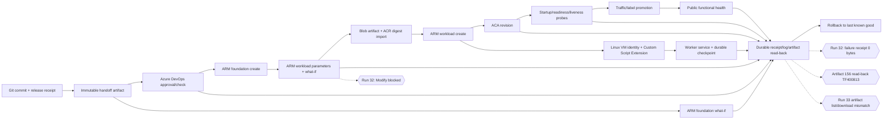

# Azure DevOps + Linux VM/ACA 릴리스 루프 근본원인 지식그래프

## 문서 메타데이터

- 조사일: 2026-09-07 (Asia/Seoul)
- 대상: `devdoo-teams/teams-app`, canonical worktree `/Users/doosansmacbookpro/Documents/TeamsApp`, `main`
+ 조사 기준 HEAD: `930d4f7125b25a9b96ad2a11df1203a99b397903`
- 제품 버전: `1.0.103` (이번 조사에서는 버전 변경 없음)
+ 운영 사건: Azure DevOps Run 32 / Build `20260906.11`부터 Run 46 / Build `20260907.2`까지
- 조사 범위: Azure DevOps 승인·배포·아티팩트 계약, ARM what-if 및 Bicep 경계, Azure Container Apps revision/health/traffic, ACR managed identity, Linux VM/cloud-init/Custom Script Extension, 24/7 worker 상태·증거 체인
- 증거 분류: `OFFICIAL CONTRACT`, `OBSERVED REPOSITORY EVIDENCE`, `INFERENCE / RECOMMENDATION`, `LIVE UNVERIFIED`
- 이 문서는 읽기·리서치·문서화 결과다. 이번 문서 갱신 자체는 Azure 리소스, Teams 앱, 트래픽, 비밀, Jira, 브라우저 세션을 변경하지 않았으며, Run 43의 pipeline 배포·실패 read-back은 아래에 별도 기록한다.

## 결론

현재 반복 실패의 주원인은 게이트의 개수가 많다는 사실 자체가 아니다. 더 근본적인 원인은 다음 네 가지 경계가 한 릴리스 작업에 결합되어, 한 단계의 실패가 다른 단계의 상태·증거·재시도 동작을 오염시키는 구조다.

1. **소스/아티팩트 경계**: deployment job이 release commit으로 `checkout --detach`한 뒤, 그 commit에 없는 실패-receipt helper를 실행하려 했고, `ERR` trap 내부 오류가 억제되어 0-byte receipt가 남았다. 이 구체적 결함은 `9c793d4`에서 helper를 release checkout 전에 `Agent.TempDirectory`로 snapshot하도록 수정했고, RED/GREEN 테스트와 Core 27/27로 확인했다.
2. **계획/변경 경계**: foundation `create`가 먼저 실행된 뒤 workload `what-if`가 실행된다. 따라서 workload what-if가 `Modify`를 발견해도 이미 foundation 변경이 일어난 뒤이며, “계획→승인→변경”의 단일 경계가 아니다. Run 32는 정확히 이 `workload-parameters-and-what-if`에서 차단됐고 workload create/revision/traffic/public health는 수행되지 않았다.
3. **플랫폼 책임 경계**: Azure DevOps approval, ARM deployment, ACA revision readiness, VM extension/worker readiness, public functional health가 각각 다른 시스템인데 하나의 `READY`처럼 취급될 위험이 있다. 공식 Azure DevOps 문서는 deployment lifecycle을 `preDeploy → deploy → routeTraffic → postRouteTraffic → success/failure`로 분리한다.
4. **증거 read-back 경계**: what-if artifact 156은 생성되었지만 MCP download가 `TF400813`으로 거부되어 property delta가 `UNVERIFIED`다. Run 33의 pre-approval receipt 158, 160, 162, 163도 목록에는 비어 있지 않은 크기로 보였지만 MCP download 결과는 동일한 62-byte authorization text였다. failure artifact 157은 0-byte/0-file로 생성됐다. 플랫폼 상태, exit code, artifact 존재만으로 원인을 확정하면 안 된다.

따라서 지금 필요한 것은 허용목록을 추측으로 넓히는 일이 아니라, **계획·변경·검증·롤백·증거를 단계별로 분리하고 각 단계가 자기 identity와 durable receipt를 갖게 하는 재구성**이다.

## Run 32의 정확한 상태

### 관찰된 결과

- 승인 단계는 통과했지만 Azure workload what-if에서 실패했다.
- 보존된 로그의 경계:

  ```text
  Azure workload what-if diagnostic: BLOCKED
  Invalid Azure canary preflight: what-if contains disallowed Modify change for
  /subscriptions/0e58c3cb-474d-4e70-978a-4939c586f867/resourceGroups/rg-teamsapp-canary/providers/Microsoft.App/containerApps/teamsapp-canary-goictvxm
  boundary=workload-parameters-and-what-if exitCode=1
  ```

- Azure workload `create`, ACA revision activation/show, traffic switch, public `/api/health`는 이 Run에서 실행되지 않았다.
- `azure-what-if-workload-receipt` artifact id 156은 업로드되었지만 MCP read-back은 `TF400813: The user is not authorized to access this resource`로 실패했다. 따라서 `Modify`의 실제 property path/type multiset은 현재 `UNVERIFIED`다.
- `azure-deployment-failure-receipt` artifact id 157은 `Processed 0 files`, `Uploaded 0 out of 61 bytes`였다. 이는 Azure workload 원인의 증거가 아니라 실패 증거 생성 경계의 결함이었다.

### 확인된 수정

- `9c793d4d5f2c436223d3c8c8fa228b052515c8fa` — `fix(ci): preserve deployment receipt helper`
  - release commit checkout 전에 `scripts/azure-deployment-failure-receipt.mjs`를 `$(Agent.TempDirectory)`로 복사
  - 이후 `ERR` trap은 checkout된 release tree가 아니라 보존된 helper를 호출
  - `npm run test:azure-deployment-failure-receipt`: RED 재현 후 GREEN
  - `npm run test:azure-core`: 27/27 PASS
- `d67a84abff49134021ac3076eb326a076f6dcda8` — Run 32와 OKF bundle 기록 문서화
- 두 커밋은 원격 `main`에 push되었고 현재 worktree와 `origin/main`은 동일하다.
- 이 수정은 receipt 유실을 고쳤을 뿐이며 Run 32의 `Modify` classification을 해결하거나 Azure deployment success를 증명하지 않는다.

## Run 33의 pre-approval receipt read-back 불일치

### 관찰된 결과

- Run `33` / build `20260906.12`는 pipeline source `main@92b95d5364e610c827b7f396c2c832ebc961ad10`, deploy-only release artifact commit `71df02e2ea9e9dbecbe864e0f1c6be3d649cbb4a`, 제품 버전 `1.0.103`으로 실행되었다.
- Azure DevOps build log의 마지막 관찰 지점은 사전 승인 Azure gate job의 `Finalize Job`이다. API 상태는 계속 `state=1`이고 이후 DeployCanary/ACA mutation을 수행했다는 로그는 관찰되지 않았다. 환경 check 대기라고 단정하지 않으며 직접 stage status read-back이 없으므로 현재 실행은 `RUN_IN_PROGRESS`로만 분류한다.
- Azure DevOps MCP `pipelines_artifact.list`는 다음 artifact를 목록과 보고 크기로 반환했다: `158 approval-configuration-receipt` (343), `160 azure-platform-preflight-receipt` (856), `162 azure-rbac-preflight-receipt` (275), `163 azure-what-if-preflight-receipt` (44495).
- 같은 MCP `pipelines_artifact.download`를 각 artifact에 수행한 뒤 생성된 로컬 파일은 모두 ZIP이 아닌 ASCII 62-byte 파일이었다. 네 파일의 SHA-256은 모두 `3d632e252d055b8f89c79a59b004ea7c747c9ae9b90d47cfaf0445eed56ea52f`이고 내용은 `TF400813: The user is not authorized to access this resource.`였다.

### 판정

- `ARTIFACT_READBACK_UNVERIFIED`: artifact 목록의 reported size와 실제 download bytes가 일치하지 않는다. 이 결과로 approval receipt, RBAC receipt, what-if JSON, checksum을 읽었다고 주장할 수 없다.
- `RUN_IN_PROGRESS`: Run 33의 실행 상태와 artifact read-back은 별도 경계다. Run이 계속 실행 중이라는 사실은 Azure mutation, ACA revision readiness, public health, Teams UI를 증명하지 않는다.
- `INFERENCE ONLY`: MCP 인증 범위·download URL·wrapper 변환 중 어느 경계가 62-byte 응답을 만들었는지는 현재 관찰만으로 확정하지 않는다. property delta나 allowlist를 추측으로 바꾸지 않는다.

### 다음 조치

- Run 33을 중복 실행하거나 현재 run을 취소하지 않고 authorized Azure DevOps artifact REST/MCP read-back 경계를 먼저 복구한다.
- 유효한 ZIP/header와 내부 JSON, sidecar SHA-256을 읽어 back-to-back 검증하기 전까지 pre-approval receipt는 `UNVERIFIED`로 유지한다.
- Run 33이 종료된 뒤에만 final result, failure receipt, Azure revision/system/application logs를 각각 read-back한다. 그 전에는 Azure mutation·release success·Teams 완료보고를 하지 않는다.

## 지식그래프



### 그래프에서 반드시 분리해야 하는 상태

| 노드 | 성공이 증명하는 것 | 증명하지 않는 것 |
|---|---|---|
| Git/release receipt | source commit·version·digest의 선언과 검증 | Azure 리소스 또는 Teams 설치 |
| Azure DevOps approval | resource owner가 stage 실행을 허용한 것 | Azure deployment 성공 |
| ARM foundation what-if | 현재 대상에 대한 provider-level 계획 | workload revision/worker health |
| ARM foundation create | 기반 리소스의 요청 처리 | 신규 ACA replica가 healthy라는 사실 |
| workload what-if | workload 변경 계획이 허용된다는 판단 | create·revision·traffic |
| ACR import/read-back | 이미지 digest가 ACR에 존재한다는 사실 | ACA가 그 이미지를 pull하고 실행했다는 사실 |
| VM extension | extension handler가 명령을 수행했다는 사실 | worker가 queue를 소비하고 terminal receipt를 남겼다는 사실 |
| ACA readiness | replica가 probe를 통과한 상태 | `/api/health`의 핵심 의존성·Teams 왕복 |
| public functional health | 외부 endpoint의 응답과 release identity | Teams desktop/mobile UI |
| Teams UI | 사용자가 보는 실제 앱 응답 | Azure 내부 worker가 독립적으로 durable하다는 사실 |

## 공식 계약과 현재 구현의 대조

### 1. Azure DevOps approval은 YAML이 아니라 resource owner의 check다

**OFFICIAL CONTRACT.** Microsoft 문서의 `Define approvals and checks`는 approvals/checks가 YAML에 정의되지 않으며 resource administrator가 관리한다고 명시한다(본문 관찰 line 33–39). 정적 검사, pre-approval, dynamic approval, post-approval, exclusive lock 순서도 별도다(line 42–48).

**OBSERVED REPOSITORY EVIDENCE.** `azure-pipelines.yml:432-489`는 `deployment` job과 `environment`를 사용하고 승인 후 하나의 큰 AzureCLI task에서 foundation create부터 workload verification까지 수행한다.

**판정.** 승인 통과를 배포 성공으로 승격할 수 없다. 승인 증거와 Azure mutation 증거를 별도 상태로 유지해야 한다.

### 2. Deployment job은 lifecycle hook으로 변경과 rollback을 분리해야 한다

**OFFICIAL CONTRACT.** Microsoft의 `Deployment jobs` 문서는 deployment job이 환경에 순차 실행되며 deployment history를 제공하고, 안전한 배포는 초기화·배포·트래픽 전환·전환 후 테스트·실패 시 last-known-good 복구를 수행해야 한다고 설명한다(본문 line 37–43, 55–71). `on: failure`/`on: success` hook도 별도로 정의된다.

**OBSERVED REPOSITORY EVIDENCE.** 현재 `DeployCanaryRevision`은 `runOnce.deploy` 하나에 foundation create, workload what-if, Blob upload, ACR import, workload create, revision show, public curl을 직렬로 넣고 있다(`azure-pipelines.yml:458-755`). `RollbackCanary`는 별도 stage이지만 failure hook에서 자동으로 보존·복구되는 구조는 아니다.

**판정.** 작업 순서 자체는 이해 가능하지만 실패 경계와 rollback 경계가 너무 넓다. 다음 구조로 분해해야 한다.

```text
preDeploy: immutable receipt + source/artifact materialization + non-mutating checks
deploy:    one bounded ARM mutation boundary
route:     explicit label/traffic action only after revision readiness
postRoute: public functional + identity + worker receipt checks
failure:   retain logs/receipt, keep old traffic, invoke bounded rollback
```

### 3. Pipeline artifact는 stage 간 명시적으로 publish/download하고 외부 보존도 필요하다

**OFFICIAL CONTRACT.** Microsoft pipeline artifact 문서는 stage 간 artifact를 publish 후 download할 수 있고(`Publish and download pipeline artifacts`, 본문 line 305–346), `$(Pipeline.Workspace)`가 기본 경로이며 pipeline artifacts 사용을 권장한다고 설명한다(line 349–355). REST `Get Artifact` API는 build id/artifact name으로 artifact resource와 download URL을 제공한다.

**OBSERVED REPOSITORY EVIDENCE.** 현재 pipeline은 `azure-what-if-workload`와 `azure-deployment-failure`를 `condition: always()/failed()`로 publish한다. 하지만 failure helper가 release checkout 후 사라져 0-byte artifact가 생성됐다. artifact 156의 property delta는 MCP 권한 오류로 read-back하지 못했다.

**판정.** “artifact task가 실행됐다”는 성공이 아니다. 각 failure artifact는 non-empty JSON schema, SHA-256, pipeline/run/commit/boundary, producer timestamp를 publish 전에 검증해야 하고, Azure DevOps artifact read-back 또는 승인된 외부 immutable copy 중 하나가 실제로 읽혀야 한다.

### 4. Container Apps는 readiness 후 traffic을 이동해야 한다

**OFFICIAL CONTRACT.** Azure Container Apps health probe 문서는 startup/liveness/readiness의 의미를 구분한다(본문 line 31–40). multiple revision mode에서는 readiness 성공 후 traffic을 이동해야 하며(line 166–189), ingress가 있으면 포털은 기본 TCP probes를 추가할 수 있지만 명시적 앱 계약을 대신하지 않는다.

**OBSERVED REPOSITORY EVIDENCE.** `infra/azure/modules/container-app.bicep:43-53`은 `activeRevisionsMode: 'multiple'`와 `latestRevision: true, weight: 100`을 선언하지만 `template.containers[].probes`가 없고 `minReplicas: 0`이다(`:203-215`).

**판정.** 현재 설정이 Run 32의 직접 원인이라고 단정할 수 없다. 그러나 readiness를 명시하지 않은 채 latest revision에 100%를 선언하는 것은 공식 blue/green 계약과 맞지 않는 구조적 위험이다. 0% labeled green → probe → synthetic health → traffic switch로 바꿔야 한다.

### 5. Blue/green은 revision label과 traffic weight를 이용해 검증 후 전환한다

**OFFICIAL CONTRACT.** Azure `Blue-Green Deployment in Container Apps`는 blue를 기존 stable/production, green을 신규 revision/0% traffic으로 설명하고, green을 검증한 뒤 traffic을 전환하며 문제 시 blue로 rollback하는 패턴을 제시한다(본문 line 31–57). deterministic `revisionSuffix`에는 commit/build id를 사용할 수 있다.

**OBSERVED REPOSITORY EVIDENCE.** `container-app.bicep:43-53`은 multiple revisions을 켜지만 stable/green labels와 0% pre-traffic 상태를 모델링하지 않는다. `azure-pipelines.yml:751-755`는 deployment 이후 revision show와 public health를 수행하지만 별도 traffic promotion 단계가 없다.

**판정.** “revision create와 traffic serving”을 같은 ARM update에 묶지 말고, revision identity와 promotion을 분리해야 한다. 기존 정상 revision을 유지한 상태에서 신규 revision FQDN/label을 검증해야 한다.

### 6. ACR managed identity와 image health는 별도 게이트다

**OFFICIAL CONTRACT.** Azure의 managed-identity image-pull 문서는 user-assigned identity 사용을 권장하고, private ACR image pull에는 `AcrPull` 역할과 ARM audience token 설정을 별도로 요구한다(본문 line 31–37, 47–62, 95–140).

**OBSERVED REPOSITORY EVIDENCE.** `container-app.bicep:31-59`은 user-assigned identity로 ACR registry를 설정한다. pipeline은 GHCR digest를 ACR로 import하고 imported digest를 확인한 뒤 ACA에 `registry/teamsapp@digest`를 전달한다(`azure-pipelines.yml:727-731`).

**판정.** ACR pull/identity가 Run 32 실패 원인이라는 증거는 없다. ACR system log와 ACA system log가 확보되기 전에는 ACR/managed identity를 원인으로 지목하지 않는다. image import PASS는 ACA replica readiness PASS가 아니다.

### 7. Linux VM Custom Script Extension은 짧고 idempotent한 bootstrap이어야 한다

**OFFICIAL CONTRACT.** Microsoft Custom Script Extension 문서는 script를 idempotent하게 작성하고 사용자 입력과 reboot를 피하며, 90분 제한을 준수하고, 재실행·로그를 별도로 고려하라고 한다(본문 line 68–81). managed identity는 protected settings에서 private Blob을 읽는 방식으로 사용할 수 있다(본문 line 203–243). 문제 발생 시 `/var/log/waagent.log`와 `/var/log/azure/custom-script/handler.log`를 조사한다(본문 line 383–413).

**OBSERVED REPOSITORY EVIDENCE.** `infra/azure/modules/worker-vm.bicep:243-263`은 Custom Script 2.1, protected `managedIdentity`, immutable Blob URL, `forceUpdateTag`를 사용한다. `infra/azure/scripts/install-worker-runtime.sh:45-150`은 archive/Codex digest, manifest, Node/Codex version을 검증하고 systemd를 시작한다.

**판정.** 정적 설계는 공식 방향과 대체로 맞지만 실제 VM extension·systemd·queue consumption의 live evidence가 없다. worker archive verified 또는 VM resource exists를 worker READY로 기록하면 안 된다.

### 8. 24/7 worker는 ACA/VM/상태 저장소의 책임을 분리해야 한다

**OFFICIAL CONTRACT.** Azure Web-Queue-Worker architecture는 web front end, queue, worker를 분리하고, queue-based load leveling은 장기/비동기 처리를 buffer와 retry로 분리한다. Azure VM/VMSS 문서는 VM이 OS 수준의 장기 실행 환경이라는 책임을 갖는다.

**OBSERVED REPOSITORY EVIDENCE.** 현재 template은 ACA `minReplicas: 0,maxReplicas: 1`, Storage Queue, Cosmos, Blob worker archive, single Linux VM을 함께 사용한다. runtime state는 Cosmos/Storage를 목표로 하지만 실제 live migration/reconciliation과 worker terminal receipt는 아직 검증되지 않았다.

**판정.** Core API/ACA는 stateless HTTP+queue producer/consumer 경계, Linux VM은 Codex CLI 실행 경계, Cosmos/Queue/Blob은 durable state/artifact 경계로 고정한다. Container local filesystem이나 VM runtime directory를 authoritative state로 취급하지 않는다.

## 근본 원인 분류

| ID | 원인 | 상태 | 근거 | 해결 방향 |
|---|---|---|---|---|
| RC-1 | Release checkout 뒤 failure helper가 사라짐 | **CONFIRMED / FIXED** | `azure-pipelines.yml:469-489`, release commit에는 helper 부재, RED/GREEN test | snapshot 경계를 유지하고 failure receipt non-empty 검증 추가 |
| RC-2 | `ERR` trap의 receipt write 실패가 원래 실패를 가림 | **CONFIRMED / FIXED PARTIALLY** | `write_failure_receipt`가 `|| true`; Run 32 artifact 157 0-byte | receipt write 결과를 별도 `receiptWriteStatus`로 남기고, non-empty 검증 실패를 별도 pipeline error로 분리 |
| RC-3 | `Modify` actual property delta 미확보 | **OBSERVED BLOCKER** | Run 32 log 44, artifact 156 MCP `TF400813` | artifact read-back 권한/경로를 먼저 고치고 raw what-if redacted diagnostic을 확보. allowlist 변경 금지 |
| RC-4 | foundation mutation 후 workload what-if | **STRUCTURAL RISK** | `azure-pipelines.yml:594-604` 후 `:671-703` | foundation/app/workload를 계획·승인·변경 경계로 분리하거나, workload what-if를 모든 mutation 전에 실행 |
| RC-5 | ACA latest/100% traffic과 readiness가 결합 | **STRUCTURAL RISK; DIRECT CAUSE UNVERIFIED** | `container-app.bicep:43-53`, `:203-215` | labeled green 0%, explicit probes, postRoute health, explicit promotion |
| RC-6 | VM bootstrap evidence와 worker readiness 혼동 | **STRUCTURAL RISK; LIVE UNVERIFIED** | `worker-vm.bicep:243-263`, installer `:94-150` | VM extension receipt + systemd status + heartbeat + queue terminal receipt를 별도 gate로 결합 |
| RC-7 | 모든 단계가 단일 AzureCLI task에 결합 | **STRUCTURAL RISK** | `azure-pipelines.yml:458-755` | deployment lifecycle hook/job 분리, 각 hook artifact/receipt, failure hook 유지 |
| RC-8 | 로컬 Azure CLI/help와 hosted CI toolchain 불일치 | **OBSERVED** | 로컬 `az` 명령 미설치; Run 32 hosted log는 Azure CLI 2.89.1, DevOps extension 1.0.7 | CLI/Bicep version receipt를 CI artifact로 고정하고 로컬 진단은 hosted toolchain을 기준으로 재현 |

## 권장 목표 구조

### Phase 0 — 증거 체인 고정 (현재 즉시)

- `release-identity.json`을 유일한 입력으로 사용: commit, app version, Teams ZIP SHA, client/server SHA, image digest, worker archive SHA.
- 모든 job/stage가 동일한 identity를 읽고, 변형 시 즉시 fail.
- 각 failure receipt는 다음을 `wx`로 한 번만 작성하고, 작성 즉시 `test -s`, JSON parse, SHA-256, schema validation을 수행한다.
- Azure DevOps artifact publish 직후 `Get Artifact` 또는 승인된 external immutable copy로 read-back하고, 권한 오류는 성공으로 분류하지 않는다.
- `Run 32`는 새 Azure mutation을 시작하지 않고, artifact 156/157 read-back 경계를 먼저 복구한다.

### Phase 1 — 계획과 변경 분리

```text
Plan:
  release identity -> foundation what-if -> workload what-if -> redacted receipts
Approval:
  Azure DevOps resource check reads the exact plan receipt
Change:
  foundation create -> artifact import -> green ACA revision create -> VM extension
Validate:
  green readiness -> worker heartbeat/terminal receipt -> public synthetic health
Promote:
  explicit label/traffic switch only after Validate
Failure:
  preserve old traffic -> read logs/receipts -> bounded rollback
```

Foundation `create` 이후에 첫 workload what-if를 수행하는 현재 순서는 바꿔야 한다. foundation에 동적 principal IDs처럼 실제 create 전에는 결정할 수 없는 값이 있다면, 해당 리소스만 `REVIEW_REQUIRED`로 분리해 approval에 전달하고, 나머지 workload 변경을 자동 허용목록에 섞지 않는다.

### Phase 2 — ACA blue/green + 명시적 probes

- `activeRevisionsMode: multiple` 유지.
- `revisionSuffix = short commit` 유지.
- stable label과 green label을 명시한다.
- green revision은 0% traffic에서 생성한다.
- `startup`, `readiness`, `liveness`를 명시한다. `/api/health`는 readiness와 동일하게 사용하지 않고, platform readiness 후 별도 synthetic functional check로 실행한다.
- green health와 identity read-back 이후에만 `traffic set`을 실행한다.
- traffic switch 후 postRoute health와 기존 stable revision rollback command를 증거로 남긴다.
- promoted service의 `minReplicas`는 1을 기본 권장하되 비용/availability 결정을 별도 승인한다. 현재 `0`을 즉시 변경할 근거로 승격하지 않는다.

### Phase 3 — Linux worker lifecycle 분리

- VM resource existence, Custom Script Extension state, systemd active state, worker heartbeat, queue lease, terminal receipt를 각각 기록한다.
- VM extension은 archive 다운로드·digest 검증·설치까지만 담당한다. 로그인/MFA/auth.json은 out-of-band 사용자 handoff이며 archive/cloud-init/pipeline에 넣지 않는다.
- `forceUpdateTag`는 archive SHA와 일치시키고, extension 재실행이 idempotent인지 fixture와 실제 `/var/log/azure/custom-script/handler.log`로 검증한다.
- 서비스가 재시작되면 durable journal/Cosmos checkpoint에서 resume하고, 동일 task의 duplicate delivery를 idempotency key로 흡수한다.
- VM이 READY여도 ACA가 READY가 아니면 release는 READY가 아니다. 두 결과를 별도 receipt로 유지한다.

### Phase 4 — promotion/rollback과 Teams 증거

- Azure public health와 Teams desktop UI는 동일 release identity를 읽어야 한다.
- public health PASS만으로 `DESKTOP_READY`/`MOBILE_READY`를 만들지 않는다.
- Teams desktop의 실제 bot reply, card, Work Hub, task terminal receipt를 독립 캡처한다.
- 모바일/WebView는 별도 `MOBILE_UNVERIFIED`로 유지한다.
- 모든 실패는 정확한 boundary, process/pid/elapsed/lastActivity/health/nextAction과 receipt SHA를 남긴다.

## 게이트를 줄이는 방법

게이트를 삭제하는 것이 아니라 **중복 검사를 하나의 증거로 합치고, 책임 경계를 분리**한다.

### 남겨야 하는 필수 게이트

1. immutable release identity
2. clean exact source checkout
3. foundation/workload non-mutating what-if
4. approval read-back
5. failure receipt non-empty/read-back
6. ACR digest read-back
7. ACA revision readiness
8. worker archive/extension/heartbeat/terminal receipt
9. public functional health
10. explicit traffic promotion/rollback
11. Teams desktop actual UI
12. Jira evidence mapping before Done

### 한 번으로 합칠 수 있는 중복

- source commit/version/digests: `release-identity.json` 하나로 읽고 모든 단계에서 hash 비교
- what-if receipt/diagnostic: 원본 before/after 값은 비밀 최소화 원칙에 따라 보존하지 않고, raw response SHA + redacted property-path diagnostic + validator result로 조합
- VM readiness: `extension state`, `systemd state`, `heartbeat`, `terminal receipt`를 한 `worker-release-receipt.json`으로 join하되 각 하위 필드는 별도 observed status로 보존
- ACA readiness: revision metadata, probe state, synthetic `/api/health`, dependency check를 한 `aca-release-receipt.json`으로 join하되 platform status와 application status를 분리

## 다음 구현 순서

1. **먼저 Run 32의 artifact read-back 권한을 복구**한다. Azure DevOps MCP/API가 artifact 156/157을 읽지 못하는 상태에서 what-if allowlist나 Azure resource를 변경하지 않는다.
2. **receipt helper snapshot 수정의 CI 재실행**은 위 연구/계획 문서가 원인 분리된 뒤 별도 수행한다. 같은 release identity의 Run을 다시 시작할 때만 실행하며, version bump는 하지 않는다.
3. **failure receipt contract를 강화**한다: non-empty JSON, schema, checksum, producer commit/helper checksum, boundary, original exit code, receipt-write status.
4. **workload what-if를 mutation 이전으로 이동**하거나, foundation mutation을 별도 승인된 stage로 분리한다.
5. **ACA Bicep에 explicit probes와 green/stable traffic labels를 추가**한다. 이것은 사용자-visible/운영 기능 변경이므로 RED/GREEN/Core gate와 별도 version policy를 적용한다.
6. **VM worker readiness receipt와 Linux extension log read-back을 추가**한다. live VM이 존재하지 않는 현재 상태에서 VM 성공을 주장하지 않는다.
7. 위 모든 단계가 PASS한 후에만 Run을 재실행하고, public health → Teams desktop → 사용자 모바일 확인 순서로 동일 release identity를 검증한다.

## 현재 차단 목록

- Run 32 workload `Modify`의 실제 property delta: `UNVERIFIED` (artifact 156 read-back authorization failure).
- Run 32 failure receipt content: source artifact가 0-byte였고 helper fix는 현재 `main`에 있으나 새 CI run에서 retained non-empty read-back은 아직 미검증.
- Azure CLI/Bicep local help: 이 Mac에는 `az` 실행 파일이 없어 local `az --help`를 확인하지 못했다. Run 32 hosted agent의 `az`는 Azure CLI 2.89.1, azure-devops extension 1.0.7로 관찰되었다.
- Azure resource create/update, ACA revision/replica, VM extension, public health, worker terminal receipt, Teams desktop/mobile same-release UI: 현재 Run 32에서는 모두 실행 또는 증명되지 않았다.
- Run 33은 `RUN_IN_PROGRESS`이고 pre-approval artifacts 158/160/162/163의 실제 bytes가 authorization text로 반환되어 `ARTIFACT_READBACK_UNVERIFIED`다.
- 현 시점에서 `Modify` 허용목록 확대, Azure mutation success, release completion, Teams 완료보고는 금지한다.

## 공식 출처 원장

각 항목은 조사 시점의 Microsoft/Azure 1차 문서와 공식 문서 저장소를 우선했다. HTML line은 페이지 추출 기준이며, 문서 UI가 바뀌면 section heading을 함께 확인한다.

| 계약 | 공식 출처 | 관찰 위치 |
|---|---|---|
| Azure DevOps approvals/checks는 YAML 밖 resource owner가 관리 | [Define approvals and checks](https://learn.microsoft.com/en-us/azure/devops/pipelines/process/approvals?view=azure-devops) | `Define approvals and checks`, HTML lines 31–48 |
| deployment lifecycle과 failure hook | [Deployment jobs](https://learn.microsoft.com/en-us/azure/devops/pipelines/process/deployment-jobs?view=azure-devops) | `Deployment strategies`, HTML lines 37–71; `on: failure/success` |
| pipeline artifact stage handoff/read path | [Publish and download pipeline artifacts](https://learn.microsoft.com/en-us/azure/devops/pipelines/artifacts/pipeline-artifacts?tabs++=+yaml&view=azure-devops) | `Use Artifacts across stages`, HTML lines 305–355 |
| artifact REST read-back | [Artifacts - Get Artifact REST API](https://learn.microsoft.com/en-us/rest/api/azure/devops/build/artifacts/get-artifact?view=azure-devops-rest-7.1) | `GET .../_apis/build/builds/{buildId}/artifacts`, API version 7.1 |
| Custom Script Extension idempotence/no input/reboot/timeout | [Run Custom Script Extension on Linux VMs](https://learn.microsoft.com/en-us/azure/virtual-machines/extensions/custom-script-linux) | `Tips`, HTML lines 68–81 |
| Custom Script managed identity/private Blob | same as above | `Property: managedIdentity`, HTML lines 203–243 |
| VM extension diagnostics | same as above | `Troubleshooting`, HTML lines 383–413 |
| ACA startup/readiness/liveness and multiple revision traffic order | [Health probes in Azure Container Apps](https://learn.microsoft.com/en-us/azure/container-apps/health-probes) | `Probe types`, HTML lines 31–40; `Default configuration`, lines 165–189 |
| ACA blue/green labels/weights/rollback | [Blue-Green Deployment in Azure Container Apps](https://learn.microsoft.com/en-us/azure/container-apps/blue-green-deployment) | HTML lines 31–57 |
| ACA ACR managed identity and `AcrPull` | [Azure Container Apps image pull with managed identity](https://learn.microsoft.com/en-us/azure/container-apps/managed-identity-image-pull) | HTML lines 31–37, 47–62, 95–140 |
| Azure web-queue-worker boundary | [Web-Queue-Worker architecture style](https://learn.microsoft.com/en-us/azure/architecture/guide/architecture-styles/web-queue-worker) | `Architecture`, `Considerations`, current page sections |
| official ACA Bicep examples | [microsoft/azure-container-apps templates/bicep](https://github.com/microsoft/azure-container-apps/tree/main/templates/bicep) | public `main` tree: `main.bicep`, `workloadProfiles`, `ruleBasedRouting` |
| official Azure DevOps deployment example | [microsoft/azure-pipelines-yaml deployment design](https://github.com/microsoft/azure-pipelines-yaml/blob/master/design/deployment.md) | `A deployment job`, lines 196–243 |
| official Azure DevOps job model | [MicrosoftDocs/azure-devops-docs phases.md](https://github.com/MicrosoftDocs/azure-devops-docs/blob/main/docs/pipelines/process/phases.md) | `Specify jobs in your pipeline`, lines 199–279 |
| official Linux extension source | [MicrosoftDocs/azure-compute-docs custom-script-linux.md](https://github.com/MicrosoftDocs/azure-compute-docs/blob/main/articles/virtual-machines/extensions/custom-script-linux.md) | source mirror of current Custom Script contract |

## Final decision

The current direction is **not** to discard the safety gates and **not** to widen the what-if allowlist. The correct direction is to make each gate a small, independently readable contract with a durable receipt, then promote only when the graph path is complete:

```text
identity -> plan -> approval -> mutation -> ACA readiness + VM worker readiness
         -> public functional health -> explicit traffic promotion
         -> Teams desktop/mobile evidence -> completion
```

Until the `Modify` delta and retained failure receipt are read back from a new verified run, Azure and Teams release status remains `BLOCKED/UNVERIFIED`.

## Run 40 correction record

Run 40 reached the post-approval revision boundary after the worker Blob metadata query correction succeeded. The hosted task rejected `teamsapp-canary-goictvxm--71df02e2ea` because the poll accepted only `Running`; the existing Ego Lite Azure Container Apps read-back showed `Healthy`, `ScaledToZero`, `100%` traffic, and `0` replicas. Microsoft documents zero running replicas as the `Scale to 0` state and separately states that `minReplicas >= 1` is required to keep an instance always running. This is therefore a false-negative readiness classification for the HTTP canary, not evidence of a crash; it is not 24/7 proof.

The same Run 40 failure showed that a non-empty failure receipt cannot be guaranteed by an `ERR` trap alone: the explicit `exit 1` branch ended with artifact `221` reported at zero bytes and log 46 recording `Processed 0 files`. The correction uses one nonzero `EXIT` trap for receipt generation plus cleanup and adds an explicit-exit shell regression. These findings are now linked from the OKF `failure-history.md`, `faq.md`, `gates.md`, and `log.md`; the source tests are green, but hosted verification remains pending.

## Run 41 evidence boundary

Run 41 exercised the Run 40 source correction and retained a valid failure receipt: the Azure DevOps artifact UI showed a 476-byte JSON file and a 65-byte checksum sidecar, and the JSON read-back identified `revision-and-health`, exit code 1, and run 41. The revision still did not pass because Run 41 was queued before the later `Provisioned`-state diagnostic change. The official revision contract lists `Provisioned` as the successful provisioning state, but no raw `revision.json` was retained by Run 41; therefore that mismatch remains `REVIEW_REQUIRED`, not a confirmed live root cause. The next bounded run must log only the non-secret revision fields needed to distinguish provisioning, running, health, traffic, and replica state.

## Run 42 final identity helper provenance gap

Run 42 / Azure DevOps build `20260906.21` used pipeline source `b38a1eb786b5da639314ecf2d04a81edb0190d50`, deploy-only release commit `71df02e2ea9e9dbecbe864e0f1c6be3d649cbb4a`, application version `1.0.103`, and image digest `sha256:a52d4d53baee73cd3769ac297b723f8b05883500692d2ce4b4eb856f07ee1f27`. Handoff, approval, worker Blob staging, workload deployment, the updated revision readiness poll, and the public health fetch completed. The run then failed at `final-identity-contract` with `Invalid Azure deployment contract: revision readiness or traffic state is not complete`. The task recorded `receiptWriteStatus=READY` and checksum `6e8a536eccb8da674b37f33b3b60dc713ab637a72a572e759ebc61addbb846af`.

The pipeline source had the corrected `Provisioned`/`ScaledToZero + Healthy` predicate, but the release checkout was performed before the final identity command. The release commit's copy of `scripts/azure-deployment-contract.mjs` still required `Running` and `Succeeded`; `git show 71df02e2:scripts/azure-deployment-contract.mjs` confirmed that older contract. This is a confirmed provenance defect, `RELEASE_CHECKOUT_CONTRACT_HELPER_DRIFT`, not evidence that the Azure public endpoint was down. A separate curl returned HTTP 200 with `ok=true`, application version `1.0.103`, the release source identity, and authenticated Teams Core fields; worker heartbeat/readiness and A2A remained unavailable.

The minimal correction snapshots the contract helper to the agent temporary directory before `git checkout --detach "$commit"` and invokes the preserved absolute path. `scripts/azure-platform-contract-test.mjs` first failed on the missing ordering assertion (RED), then passed with the deployment-contract and failure-receipt tests (GREEN). This is a CI/release-gate fix, so version `1.0.103` is unchanged and no Teams package upload is justified. The correction is pending a clean Core gate and one bounded hosted rerun; the current release remains `BLOCKED`.

## Run 43 incomplete release-critical helper closure

Node.js's official ECMAScript-module contract resolves a relative specifier from the importing module and requires the explicit file extension ([Node.js ESM documentation](https://nodejs.org/api/esm.html), `import Specifiers` and `Mandatory file extensions`, observed lines 212-226). Run 43 / build `20260906.22` demonstrated why a single-file snapshot is insufficient: the pipeline copied `azure-deployment-contract.mjs` before release checkout, but that file imports `./azure-release-input.mjs`.

The run used pipeline source `10d340b5f7bd04b3d14f2e407c02e567ed2eef5c`, release commit `71df02e2ea9e9dbecbe864e0f1c6be3d649cbb4a`, version `1.0.103`, and image digest `sha256:a52d4d53baee73cd3769ac297b723f8b05883500692d2ce4b4eb856f07ee1f27`. Handoff, hosted Core 26/26, approval, worker Blob, workload deployment, the updated revision poll, and a 2920-byte public health response completed. The final identity step failed with the exact hosted error `ERR_MODULE_NOT_FOUND` for `/home/vsts/work/_temp/azure-what-if-receipt-tools/azure-release-input.mjs`, imported from the preserved deployment helper.

The failure artifact was retained: artifact `245` was listed at `545 B`, and the task recorded `receiptWriteStatus=READY` with SHA `2651ec69422d53fa8a0674ff4101c195e16b2fc4c778c61e57a80950dabd2019`. This is `CONFIRMED_ROOT_CAUSE` / `INCOMPLETE_RELEASE_CRITICAL_HELPER_CLOSURE`. The public health response is useful live evidence but does not pass the final identity gate.

The next minimum change is to copy and assert `scripts/azure-release-input.mjs` in the same temporary helper directory before release checkout. A regression must execute the snapshotted deployment helper after checkout with a valid fixture receipt and fail if any local relative import is absent. The closure must remain explicit and minimal; copying the whole repository would hide provenance errors. Version `1.0.103` remains unchanged, and the hosted release stays `BLOCKED` until clean Core and one bounded rerun pass.

## Run 44 Azure canary identity pass

Run 44 / build `20260906.23` used pipeline source `95771889b31b42ffca8a218315e2bff1dfd50557`, deploy-only release commit `71df02e2ea9e9dbecbe864e0f1c6be3d649cbb4a`, application version `1.0.103`, and image digest `sha256:a52d4d53baee73cd3769ac297b723f8b05883500692d2ce4b4eb856f07ee1f27`. After the explicit helper-closure correction, the run passed handoff, hosted Core `26/26`, environment approval, worker Blob staging, workload deployment, accepted revision readiness, public health fetch, and final identity verification. Log 44 recorded `Azure release deployment verified` with the exact release identity.

Independent public health returned HTTP 200 with `ok=true`, the same application version and source commit, server bundle SHA `c7be7000078e7f1d439c8700cff30445515c1f4a1e34c04152a97b42612948b4`, `environment=production`, `auth=teams-authenticated`, `userAuth=entra-sso`, `bot=teams-sdk`, and `outbound=teams-sdk`. The existing Ego Lite ACA page showed `teamsapp-canary-goictvxm--71df02e2ea` as `Healthy`, `ScaledToZero`, traffic `100`, replicas `0`.

This resolves the Run42/43 final-identity helper provenance failures for the tested HTTP canary. It does not prove the requested 24/7 worker: the health response still reported worker heartbeat `not-observed`, worker readiness `unavailable`, execution boundary `external-linux-worker-unverified`, and A2A `unavailable`. Teams package registration, installed desktop/mobile UI, and live Linux worker evidence remain `UNVERIFIED`; the overall release is `AZURE_CANARY_DEPLOYMENT_PASS / RELEASE_BLOCKED`.

## Run 45 invalid queue parameters

The Azure DevOps pipeline MCP queue call for Run 45 / `20260907.1` returned empty required template parameters: `githubReleaseCommit`, `azureDevOpsEnvironmentId`, `codexPackageUrl`, `codexPackageSha256`, and `codexPackageVersion`. The source version was `930d4f7`, but `ValidateHandoff/bootstrap` failed before GitHub handoff or Azure mutation. This is a confirmed operator invocation error, not an Azure runtime failure. The prevention is a queue read-back gate that rejects empty or mismatched template parameters before monitoring or approval.

## Run 46 worker runtime readiness gate

Run 46 / `20260907.2` used source `930d4f7`, release commit `71df02e2`, version `1.0.103`, and the same image digest. It passed handoff, hosted Azure Core `29/29`, approval configuration, manual approval, workload what-if, Blob staging, workload deployment, ACA revision readiness, and public health. The newly enforced VM gate then executed Azure Linux VM `RunShellScript` through the VM agent and failed closed with `auth_file was "missing"; expected "present"`. Microsoft documents the Run Command VM-agent and non-interactive `RunShellScript` contract at https://learn.microsoft.com/en-us/azure/virtual-machines/linux/run-command.

The failure receipt was read back through the existing Ego Lite Azure DevOps tab: artifact UI `536 B`, JSON `471 B`, sidecar `65 B`; body boundary `worker-runtime`, exit `1`, source commit `71df02e...`, release version `1.0.103`, pipeline run `46`, and `rawErrorPersisted=false`. The JSON SHA matched the sidecar prefix `f8975bcf...`. The probe never reads auth contents; it checks regular owner-only metadata and runs `codex login status` as `teamsworker` with a bounded timeout.

Root cause is now separated from earlier Azure canary status: Run44's successful `Succeeded` was only an ACA HTTP canary result because worker auth/readiness was not a pipeline gate. The VM systemd service was active, but the auth home was missing. This is `CONFIRMED_ROOT_CAUSE` / `WORKER_AUTH_OUT_OF_BAND_MISSING`. Current state is `AZURE_CANARY_HTTP_PASS / WORKER_RUNTIME_GATE_BLOCKED / RELEASE_BLOCKED`; no version bump or Teams package upload is justified.
